<!--
marp: true
title: HPA for Dummies
description: A quick intro
theme: gaia
pagination: true
-->
<!--_class: invert-->
# <!--fit-->HPA for Dummies

## _And why we do need them?_

‎
**Todd Edwards**
Systems Engineering
:speech_balloon: [#team-syseng](https://vitalsource.slack.com/archives/CB3P6TNNR)
:blue_book: [systems.vitalsource.com](https://systems.vitalsource.com)

<!-- Hello! My name is Todd. -->
<!-- I work on the Systems Engineering team here at VST. -->
<!-- Today I'm going to give you a quick demo of Kubernetes HPA's. -->


---
<!--_class: lead invert-->
# <!--fit-->What is an HPA?

> [A] Horizontal Pod Autoscaler automatically scales the number of Pods in a replication controller, deployment, replica set or stateful set based on observed CPU utilization [SNIP] some other application-provided metrics.

<!-- What is an HPA? -->
<!-- By default, Horizontal Pod Autoscaler scales your pods based on CPU request utlization. -->


---
<!--_class: invert-->
# <!--fit-->How do I create one?
```sh
$ kubectl get deployment
NAME      READY   UP-TO-DATE   AVAILABLE   AGE
rte-dev   2/2     2            2           16h

$ kubectl autoscale deployment rte-dev --cpu-percent 100 --min=2 --max=4
horizontalpodautoscaler.autoscaling/rte-dev autoscaled

```

<!-- CPU based HPA's can be created and updated using the autoscale kubectl built-in. -->:


---
<!--class: invert-->
# <!--fit-->What does it look like?

```yaml
$ kubectl get hpa rte-dev -o yaml
apiVersion: autoscaling/v1
kind: HorizontalPodAutoscaler
  name: rte-dev
  namespace: rte-dev
spec:
  maxReplicas: 4
  minReplicas: 2
  scaleTargetRef:
    apiVersion: apps/v1
    kind: Deployment
    name: rte-dev
  targetCPUUtilizationPercentage: 100
```

<!-- This is the resource that the autoscale command created for us. -->
<!-- It can be modified via the API the same as all other kubernetes resources. -->


---
<!--class: invert-->
# <!--fit-->How does it work?

# <!--fit-->

<!-- Pods are constantly feeding the metrics server with data that the HPA will then consume. -->
<!-- When utilization surpasses your target, the HPA controller will set the replica count of your resource to the desired armount, based on utilization.-->


---
<!--class: invert-->
# <!--fit-->How does it REALLY work?

```sh

desiredReplicas = ceil[currentReplicas * ( currentMetricValue / desiredMetricValue )]

```

> *if the current metric value is 200m, and the desired value is 100m, the number of replicas will be doubled, since 200.0 / 100.0 == 2.0 If the current value is instead 50m, we'll halve the number of replicas, since 50.0 / 100.0 == 0.5.*

<!-- This.. -->
<!-- It's important to understand the HPA's algorithm in order to tune your applications. -->
<!-- The current metric value in this equation, for a CPU based HPA, is the utilization of the CPU request, not the CPU limit. -->
<!-- This is a very common mistake that people make. -->

---
<!--class: invert-->
# Tolerations, delays, and sync intervals

| Activity     | Frequency | Switch                                              |
|:-------------|:---------:|----------------------------------------------------:|
| Tolerance    | 10%       | --horizontal-pod-autoscaler-tolerance               |
| Scale Up     | 3 min.    | --horizontal-pod-autoscaler-upscale-delay           |
| Scale Down   | 5 min.    | --horizontal-pod-autoscaler-downscale-stabilization |
| Sync Metrics | 15 sec.   | --horizontal-pod-autoscaler-sync-period             |

<!-- This chart shows you some default values that play the decisions that the HPA has to make. -->
<!-- By default the HPA has a tolerance value of ten percent.-->
<!-- This means that your utlization can be plus or minus ten percent of your HPA's target and your app won't scale. -->
<!-- After a scale up event, your app won't scale again for 3 minutes. -->
<!-- Thie was deprecated in version 0.12 and is no longer configurable. -->
<!-- After a scale down event, your app won't scale again for 5 minutes. -->

---
<!--class: invert-->
# Thank you!


#### Resources

- [kubernetes.io](https://kubernetes.io/docs/tasks/run-application/horizontal-pod-autoscale/#support-for-horizontal-pod-autoscaler-in-kubectl)
- [cloud.google.com](https://cloud.google.com/kubernetes-engine/docs/concepts/horizontalpodautoscaler)
- [rancher.com](https://rancher.com/docs/rancher/v2.x/en/k8s-in-rancher/horitzontal-pod-autoscaler/manage-hpa-with-kubectl/)

<!-- Thank you! -->

